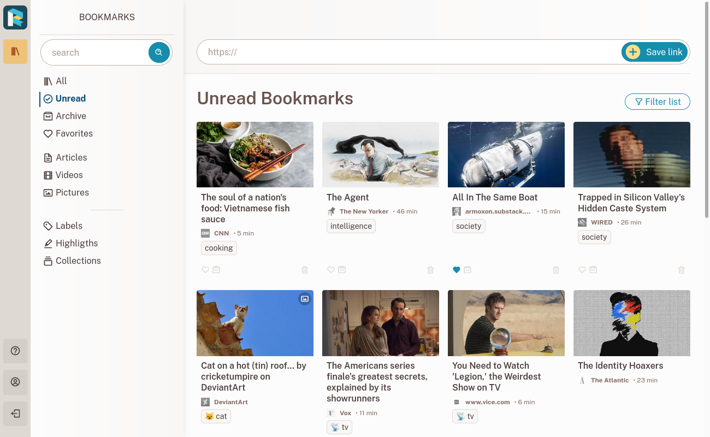

# Readeck

[](https://www.gnu.org/licenses/agpl-3.0)

Readeck is a simple web application that lets you save the
precious readable content of web pages you like and want to keep
forever. \
See it as a bookmark manager and a read later tool.



## Features

### 🔖 Bookmarks

Like a page you're reading? Paste the link in Readeck and you're done!


### 📸 Articles, pictures and videos

Readeck saves the readable content of web pages for you to read later. It also detects when a page is an image or a video and adapts its process accordingly.


### ⭐ Labels, favorites, archives

Move bookmarks to archives or favorites and add as many labels as you want.


### 🖍️ Highlights

Highlight the important content of your bookmarks to easily find it later.


### 🗃️ Collections

If you need a dedicated section with all your bookmarks from the past 2 weeks labeled with "cat", Readeck lets you save this search query into a collection so you can access it later.


### 📖 Ebook export

What's best than reading your collected articles on your e-reader? You can export any article to an e-book file (EPUB). You can even export a collection to a single book!

On top of that, you can directly access Readeck's catalog and collections from your e-reader if it supports OPDS.


### 🔎 Full text search

Whether you need to find a vague piece of text from an article, or all the articles with a specific label or from a specific website, we've got you covered!


### 🚀 Fast!

Readeck is a modern take on so called boring, but proven, technology pieces. It guaranties very quick response times and a smooth user experience.


### 🔒 Built for your privacy and long term archival

Will this article you like be online next year? In 10 year? Maybe not; maybe it's all gone, text and images. For this reason, and for your privacy, text and images are all stored in your Readeck instance the moment you save a link.

With the exception of videos, not a single request is made from your browser to an external website.

## How to install

Done reading this promotional content? Good! Want to try Readeck on your laptop or a server? Even better!

### Binary file installation

- Go to the [releases](https://codeberg.org/readeck/readeck/releases) page and grab the binary release matching your system,
- Rename the file to `readeck` (or anything you fancy),
- Make the `readeck` file executable if not already the case,
- Move this file to the directory you just created,
- Go to the directory and launch the `readeck serve` command.


```bash
cd readeck
chmod a+x readeck
./readeck serve
```

The first time you launch Readeck, you'll have to create a user (you!) and then be on your way.

At the end of this short process, Readeck start and is accessible on:

**[http://localhost:5000/](http://localhost:5000/)**

### Container

If you prefer to install or test Readeck with Docker or Podman, create a `readeck` folder somewhere and run the image:

```bash
mkdir readeck
cd readeck
docker run --rm -ti -p 5000:5000 -v $(pwd):/readeck codeberg.org/readeck/readeck:latest
```

You'll find all the container images there: \
[https://codeberg.org/readeck/-/packages/container/readeck/latest](https://codeberg.org/readeck/-/packages/container/readeck/latest)

## Under the hood

Readeck was born out of frustration (and COVID lock-downs) from the tools that don't save everything related to the saved content, primarily images.
This key principle guided every step of Readeck development.

### The ZIP file

Every bookmark is stored in a single, immutable, ZIP file. Parts of this file (HTML content, images, etc.) are served directly by the application or converted to a web page or an e-book when needed.

### A simple database

Readeck has a very simple database schema with a few tables and uses a lot of JSON fields when appropriate. The recommended database engine is SQLite for an installation with a few users.

### A simple stack

Unlike many modern web applications, Readeck is not a single page application built on top of an API. There's not even a separate worker process.

Readeck is written in [Go](https://go.dev/) and all its content is rendered server side with some interactivity brought by [Stimulus](https://stimulus.hotwired.dev/) and [Turbo](https://turbo.hotwired.dev/).

This has proven to be a great combination when performance really matters.


## License

Readeck is distributed under the terms of the [GNU Affero General Public License v3.0](https://www.gnu.org/licenses/agpl-3.0.html). Here's a short summary of the license conditions:

- Permissions
  - **Commercial use** \
      The licensed material and derivatives may be used for commercial purposes.
  - **Distribution** \
      The licensed material may be distributed.
  - **Modification** \
      The licensed material may be modified.
  - **Patent use** \
      This license provides an express grant of patent rights from contributors.
  - **Private use** \
      The licensed material may be used and modified in private.
- Conditions
  - **Disclose source** \
    Source code must be made available when the licensed material is distributed.
  - **License and copyright notice** \
    A copy of the license and copyright notice must be included with the licensed material.
  - **Network use is distribution** \
    Users who interact with the licensed material via network are given the right to receive a copy of the source code.
  - **Same license** \
    Modifications must be released under the same license when distributing the licensed material. In some cases a similar or related license may be used.
  - **State changes** \
    Changes made to the licensed material must be documented.
- Limitations
  - **Liability** \
    This license includes a limitation of liability.
  - **Warranty** \
    This license explicitly states that it does NOT provide any warranty.
