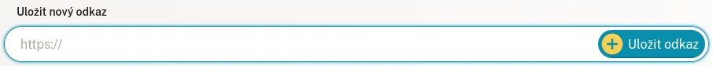
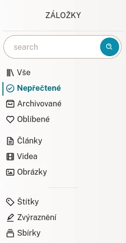
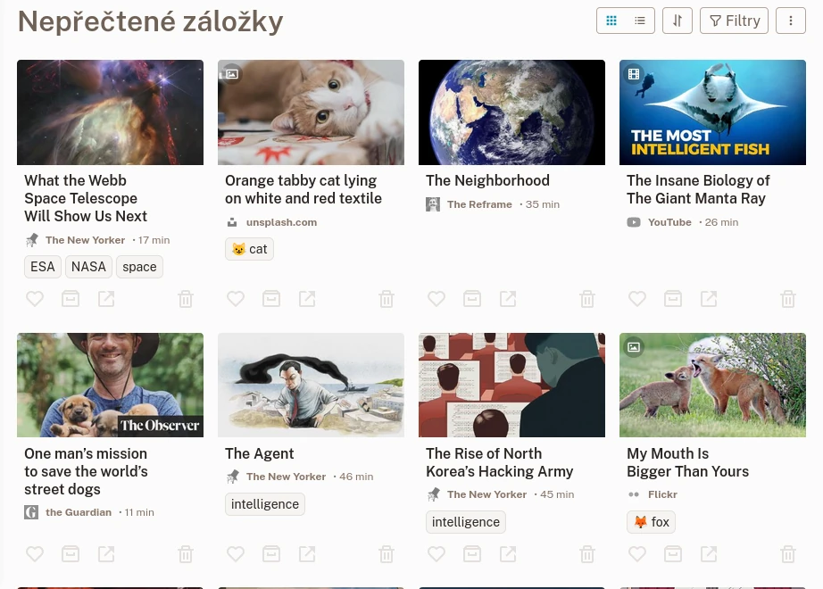
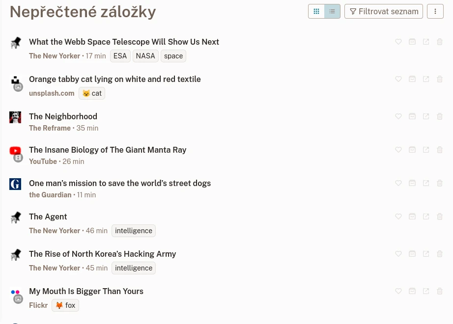
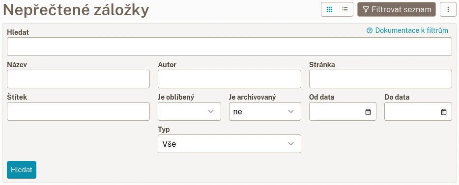

# Záložky

Záložky jsou místem, kam si ukládáte svůj oblíbený webový obsah.

## Vytvoření nové záložky

Našli jste webovou stránku, která se vám líbí? Skvělé! Zkopírujte její odkaz do textového pole s názvem **nová záložka** na [Seznamu záložek](readeck-instance://bookmarks).

Vaše záložka bude připravena za několik sekund. Poté ji můžete otevřít a číst nebo sledovat její obsah, přidávat štítky, zvýrazňovat text nebo exportovat e-knihu. Další informace naleznete v části [Zobrazení záložky](./bookmark.md).

## Typ záložky

Readeck rozpoznává 3 různé typy webového obsahu:

### Článek

Článek je stránka, ze které byl extrahován textový obsah. Vykresluje se jako čitelná verze jejího obsahu.

### Obrázek

Obrázek je stránka, která byla rozpoznána jako kontejner obrázku (např. odkaz na Unsplash). Vykreslí se uložený obrázek.

### Video

Video je stránka, která byla rozpoznána jako kontejner videa (např. odkaz na Youtube nebo Vimeo). Vykreslí přehrávač videa. Mějte na paměti, že videa se přehrávají z příslušných vzdálených serverů.

## Seznam záložek

[Seznam záložek](readeck-instance://bookmarks) je místo, kde naleznete všechny své uložené záložky.

### Navigace

Na postranním panelu naleznete vyhledávací pole a odkazy, které vás přenesou na filtrované seznamy záložek.

- **Vyhledávání** \
  Zadejte libovolný vyhledávací výraz (název, obsah, webovou stránku…).
- **Vše** \
  Všechny vaše záložky.
- **Nepřečtené** \
  Záložky, které nejsou v archivu.
- **Archiv** \
  Záložky, které jste označili jako archivované.
- **Oblíbené** \
  Záložky, které jste označili jako oblíbené.

Jakmile začnete ukládat stránky, zobrazí se následující další odkazy:

- **Články** \
  Vaše záložky článků
- **Videa** \
  Vaše záložky videí
- **Obrázky** \
  Vaše záložky obrázků

Nakonec uvidíte další 3 sekce, které vás přenesou na stránek souvisejícími se záložkami:

- **[Štítky](./labels.md)** \
  Všechny vaše štítky záložek
- **Zvýraznění** \
  Všechna zvýraznění vytvořená ve vašich záložkách
- **[Sbírky](./collections.md)** \
  Seznam všech vašich sbírek

### Karty záložek

Každá položka seznamu se nazývá Karta záložky.

Seznam záložek v mřížce

Karta zobrazuje:

- **název**, na který můžete kliknout a záložku sledovat nebo číst,
- **název stránky**,
- předpokládanou **dobu čtení**,
- **seznam štítků**,
- **akční tlačítka**

Akční tlačítka provádějí následující:

- **Oblíbené** \
  Přepíná stav oblíbenosti záložky.
- **Archivovat** \
  Přesune záložku do archivu (nebo ji z něj odebere).
- **Odstranit** \
  Označí záložku k odstranění (lze to zrušit během několika sekund).

### Kompaktní seznam

Pokud se vám zobrazení mřížky záložek zdá příliš přeplněné, můžete přepnout na kompaktnější seznam s menším počtem obrázků. Kliknutím na tlačítko vedle názvu přepnete ze zobrazení mřížky na kompaktní zobrazení.

Kompaktní Seznam záložek

## Filtrování záložek {#filters}

V seznamu záložek můžete filtrovat výsledky na základě jednoho nebo několika kritérií. Kliknutím na tlačítko „Filtrovat seznam“ vedle názvu stránky otevřete formulář pro filtrování.

Formulář pro filtrování

Zadejte libovolná kritéria a klikněte na **Vyhledat**.

### Dostupné filtry

Můžete kombinovat následující filtry:

- **Vyhledávání**\
  Vyhledávání v textu záložky, jejím názvu, autorech, názvu a doméně webu a štítcích.
- **Název**\
  Vyhledávání pouze v názvu.
- **Autor**\
  Vyhledávání pouze v seznamu autorů.
- **Stránka**\
  Vyhledávání v názvu stránky a názvu domény stránky.
- **Štítek**\
  Vyhledávání konkrétních štítků.
- **Je oblíbený**, **Je archivovaný**, **Typ**\
  Tyto filtry umožňují omezit vyhledávání na některé z těchto kritérií.
- **Od data**, **Do data**\
  Tyto poslední filtry umožňují omezit datum od kdy a do kdy byla záložka uložena. To vám například umožní vyhledat seznam záložek uložených během posledních 4 týdnů, ale ne po posledním týdnu.

### Vyhledávací dotaz

Pole **Vyhledávání**, **Název**, **Autor**, **Stránka** a **Štítek** chápou kritéria vyhledávání stejným způsobem:

- ‚vyplašená kočka‘ najde obsah se slovy **vyplašená** a **kočka**.
- ‚"vyplašená kočka"‘ najde obsah s přesnými slovy **vyplašená kočka** dohromady.
- ‚koč*‘ najde obsah se slovy začínajícími na **koč** (kočka, kočičí a kočár by se shodovaly).
- ‚-vyplašená kočka‘ najde obsah se slovem **kočka**, ale NE se slovem **vyplašená**.

Po provedení vyhledávání ho můžete uložit do nové [sbírky](./collections.md), aby bylo trvalé.

## Export a import záložek

Nabídka seznamu záložek

### Export záložek

Tlačítko nabídky vedle tlačítka filtrů umožňuje stáhnout soubor EPUB aktuálního seznamu záložek. Exportuje jednu e-knihu obsahující všechny články uspořádané do kapitol.

### Import záložek

Ve stejné nabídce najdete ### Import záložek

Ve stejné nabídce naleznete odkaz [Importovat záložky](readeck-instance://bookmarks/import). Přesměruje vás na průvodce importem, který vám umožní importovat stávající záložky z různých zdrojů.