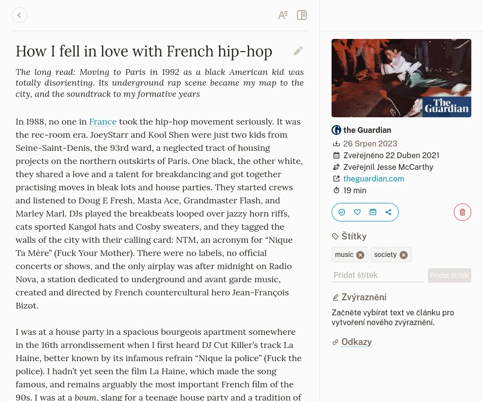
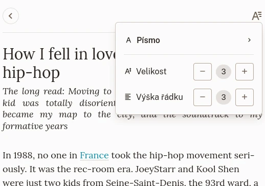
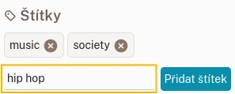
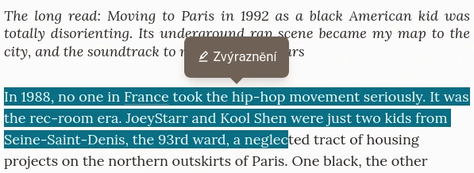

# Zobrazení záložky

## Zobrazení

Zobrazení záložky článku.

Zobrazení záložek je rozděleno na 3 části:

- Nahoře je navigace a nastavení prezentace,
- Obsah,
- Postranní panel s informacemi, štítky, zvýrazněními a akcemi.

Záložka vykresluje svůj obsah na základě svého typu. Existují 3 typy:

### Článek

Článek je stránka, ze které byl extrahován textový obsah. Vykresluje se jako čitelná verze jejího obsahu.

### Obrázek

Obrázek je stránka, která byla rozpoznána jako kontejner obrázku (např. odkaz na Unsplash). Vykreslí se uložený obrázek.

### Video

Video je stránka, která byla rozpoznána jako kontejner videa (např. odkaz na Youtube nebo Vimeo). Vykreslí přehrávač videa. Mějte na paměti, že videa se přehrávají z příslušných vzdálených serverů.

## Navigace a nastavení prezentace

V horní části zobrazení záložky je odkaz, který vás přenese zpět na předchozí stránku.

Pokud záložka obsahuje článek, tlačítko na druhé straně umožňuje změnit některá nastavení typografie.

Nastavení typografie.

Zde můžete nastavit písmo použité pro text, velikost písma a výšku řádku.\
Tato nastavení se pro vás automaticky uloží a budou platit pro všechny články, které budete později číst.

## Změna nadpisu

Nadpis záložky je automaticky získán při jejím vytvoření. Pokud z nějakého důvodu potřebujete něco jiného, můžete ho změnit tak, že na něj kliknete a poté kliknete na tlačítko na straně nadpisu.

## Akce

Na postranním panelu záložky můžete provádět akce.

### Oblíbené

Toto přepne stav oblíbenosti záložky.

### Archiv

Toto přesune záložku do archivu (nebo ji z něj odebere).

### Sdílet

Tlačítko sdílení otevře nabídku, ze které můžete vytvořit odkaz, pokud chcete článek s někým sdílet.

Ve stejné nabídce můžete záložku exportovat (zatím pouze do EPUB) a číst ji na jiném zařízení.

### Odstranit

Toto označí záložku k odstranění.\
Nemusíte se bát, že byste na to omylem kliknuli! Tuto akci lze zrušit ještě před skutečným odstraněním.

## Štítky

K záložce můžete přidat libovolný počet štítků. To provedete tak, že do pole pro štítek zadáte nějaký text a kliknete na **Přidat štítek**. Neexistuje žádné omezení, co může být štítkem. Můžete přidat i emotikony, pokud se vám líbí.

Přidání nového štítku.

Další informace naleznete v části [Štítky](./štítky.md).

## Zvýraznění

Našli jste v článku nějakou zajímavou část? Můžete ji zvýraznit!\
Když vyberete libovolný text v článku, zobrazí se nabídka, která vám umožní vytvořit nové zvýraznění.

Vytvoření nového zvýraznění.

Vaše zvýraznění se zobrazí v postranním panelu.

Když potřebujete zvýraznění odebrat, můžete to provést z postranního panelu nebo jeho výběrem v článku.