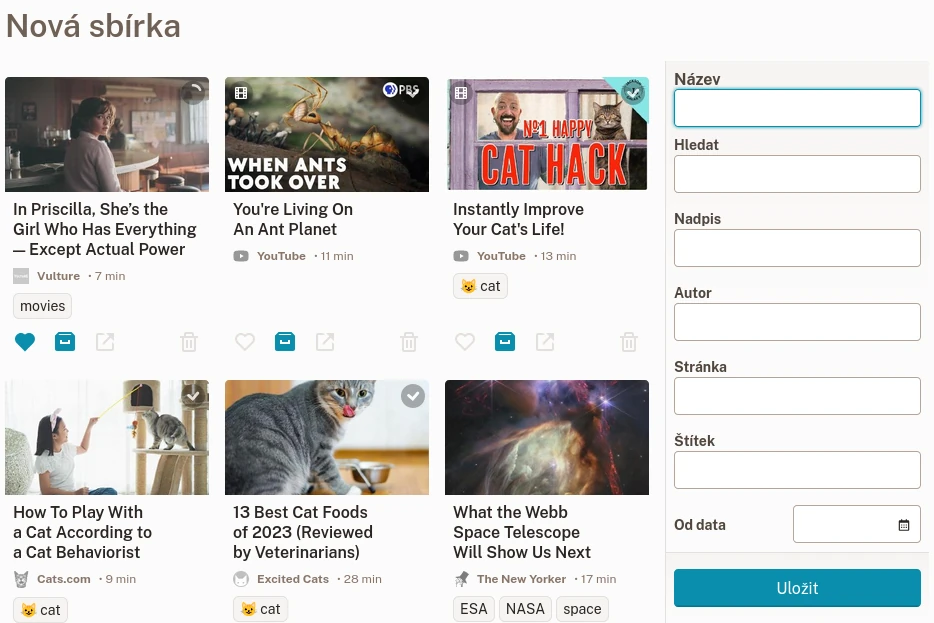

# Sbírky

Sbírky umožňují snadné uspořádání a export záložek uložením vybraných požadavků na vyhledávání.
Když vytvoříte novou záložku, která odpovídá kritériím sbírky, okamžitě se zobrazí.
Zde je několik příkladů:

- Nepřečtené články (bez obrázků a videí),
- Archivované články z „wikipedia.org“
- Obrázky se štítkem „kočka“,
- Články, které obsahují v názvu slovo „klima“.

## Vytvoření nové sbírky

Pro vytvoření nové sbírky přejděte do [Seznamu sbírek](readeck-instance://bookmarks/collections) a klikněte na **Vytvořit novou sbírku**.

Formulář sbírky

Zadejte libovolná kritéria a klikněte na **Uložit**.

Další podrobnosti o filtrování naleznete v části [filtry záložek](./bookmark-list.md#filters).

## Export sbírky

Na stránce sbírky můžete celou sbírku exportovat do souboru.

Prozatím je k dispozici pouze formát EPUB, který exportuje celou sbírku jako jednu knihu.

## Odstranění sbírky

Na stránce sbírky otevřete pole **Upravit** a klikněte na **Odstranit**.

Tuto operaci lze během několika sekund zrušit pro případ, že jste se spletli.