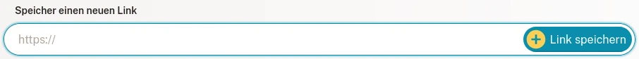
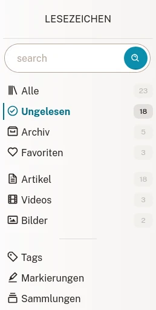
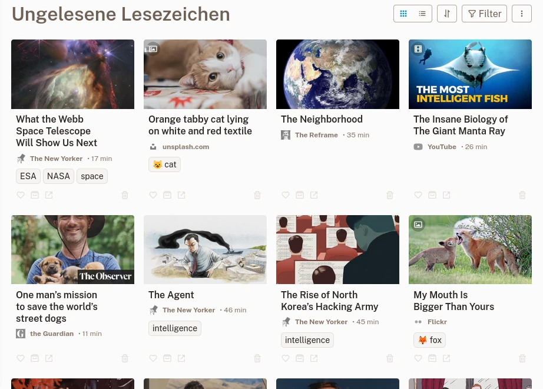
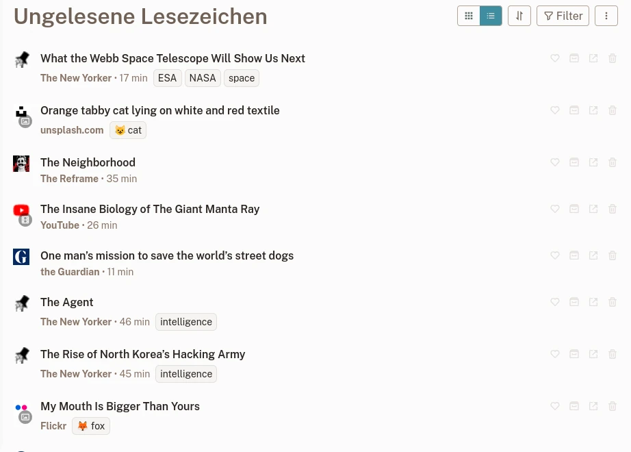
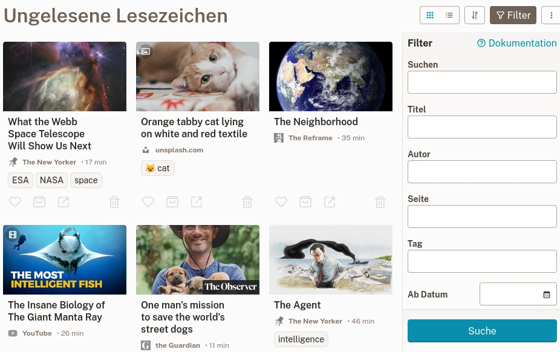
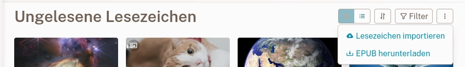

# Lesezeichen

In Lesezeichen speichern Sie die Webinhalte, die Ihnen gefallen.

## Erstellen Sie ein neues Lesezeichen

Haben Sie eine Webseite gefunden, die Ihnen gefällt? Großartig! Kopieren Sie den Link in das Textfeld **Neues Lesezeichen** in der [Lesezeichenliste] (readeck-instance://bookmarks).

Nach ein paar Sekunden ist Ihr Lesezeichen fertig. Sie können es dann öffnen, um den Inhalt zu lesen oder anzusehen, Beschriftungen hinzuzufügen, Text hervorzuheben oder ein E-Book zu exportieren. Für weitere Informationen lesen Sie bitte die [Lesezeichenansicht](./bookmark.md) section.

## Lesezeichentyp

Readeck erkennt drei verschiedene Arten von Webinhalten:

### Artikel

Ein Artikel ist eine Seite, aus der der Textinhalt extrahiert wurde. Es wird als lesbare Version seines Inhalts gerendert.

### Bild

Ein Bild ist eine Seite, die als Bildcontainer erkannt wurde (also ein Link zu Unsplash). Es rendert das gespeicherte Bild.

### Video

Ein Video ist eine Seite, die als Videocontainer identifiziert wurde (d. h. ein Link zu YouTube oder Vimeo). Es rendert einen Videoplayer. Bitte beachten Sie, dass Videos von ihren jeweiligen Remote-Servern abgespielt werden.

## Lesezeichen-Liste

Die [Lesezeichen Liste](readeck-instance://bookmarks) ist wo du all deine gespeicherten Lesezeichen findest.

### Navigation

In der Seitenleiste finden Sie ein Suchfeld und Links, die Sie zu gefilterten Lesezeichenlisten führen. In der Seitenleiste finden Sie ein Suchfeld und Links, die Sie zu gefilterten Lesezeichenlisten führen.

- **Suchen** \
  Geben Sie einen beliebigen Suchbegriff ein (Titel, Inhalt, Website...)
- **Alle** \
  Alle Ihre Lesezeichen.
- **Ungelesen** \
  Die Lesezeichen, die nicht im Archiv sind.
- **Archiv** \
  Die Lesezeichen, die Sie als archiviert markiert haben.
- **Favoriten** \
  Die Lesezeichen, die Sie als Favorit markiert haben.

Sobald Sie mit dem Speichern von Seiten beginnen, werden die folgenden zusätzlichen Links angezeigt:

- **Artikel** \
  Ihre Artikel-Lesezeichen
- **Videos** \
  Ihre Video-Lesezeichen
- **Bilder** \
  Ihre Bild-Lesezeichen

Schließlich sehen Sie drei weitere Abschnitte, die Sie zu Lesezeichen für verwandte Seiten führen:

- **[Tags](./labels.md)** \
  Alle Ihre Lesezeichen-Tags
- **Markierungen** \
  Alle in Ihren Lesezeichen erstellten Markierungen
- **[Sammlungen](./collections.md)** \
  Die Liste aller Ihrer Sammlungen

### Lesezeichenkarten

Jedes Element auf einer Liste wird als Lesezeichenkarte bezeichnet.

Raster-Lesezeichenliste

Eine Karte zeigt:

- den **Titel**, auf den Sie klicken können, um das Lesezeichen anzusehen oder zu lesen,
- der **Seiten-Name**,
- die geschätzte **Lesezeit**,
- die **Tag Liste**,
- **Aktionstasten**

Die Aktionsschaltflächen führen Folgendes aus:

- **Favorisieren** \
  Dadurch wird der Favoritenstatus des Lesezeichens umgeschaltet.
- **Archivieren** \
  Dadurch wird das Lesezeichen in die Archive verschoben (oder von dort entfernt).
- **Löschen** \
  Dadurch wird das Lesezeichen zum Löschen markiert (es kann innerhalb weniger Sekunden abgebrochen werden).

### Kompakte Liste

Wenn Ihnen die Lesezeichen-Rasteransicht zu voll ist, können Sie zu einer kompakteren Liste mit weniger Bildern wechseln. Klicken Sie auf die Schaltfläche neben dem Titel, um von der Rasteransicht zur Kompaktansicht zu wechseln.

Kompakte Lesezeichenliste

## Lesezeichen filtern {#filters}

In der Lesezeichen-Liste können Sie Ihre Ergebnisse nach einem oder mehreren Kriterien filtern. Klicken Sie auf die Schaltfläche „Liste filtern“ neben dem Seitentitel, um das Filterformular zu öffnen.

Das Filterformular

Geben Sie beliebige Kriterien ein und klicken Sie auf **Suchen**.

### Verfügbare Filter

Sie können folgende Filter kombinieren:

- **Suchen**\
  Suchen Sie im Text des Lesezeichens, seinem Titel, seinen Autoren, seinem Site-Namen und seiner Domain sowie den Labels.
- **Titel**\
  Nur im Titel suchen.
- **Autor**\
  Nur in der Autorenliste suchen.
- **Website**\
  Suchen Sie im Site-Titel und im Site-Domainnamen.
- **Tag**\
  Suchen Sie nach bestimmten Tags.
- **Ist Favorit**, **Ist archiviert**, **Typ**\
  Mit diesen Filtern können Sie Ihre Suche auf eines dieser Kriterien einschränken.
- **Ab Datum**, **Bis Datum**\
  Mit diesen letzten Filtern können Sie den Zeitpunkt und die Speicherung des Lesezeichens einschränken. Auf diese Weise können Sie beispielsweise die Lesezeichenliste abrufen, die in den letzten 4 Wochen gespeichert wurde, jedoch nicht nach der letzten Woche.

### Suchanfrage

Die Felder **Suche**, **Titel**, **Autor**, **Site** und **Label** verstehen Suchkriterien auf die gleiche Weise:

- `erschrockene Katze` findet den Inhalt mit den Wörtern **erschrocken** und **Katze**
- `"erschrockene Katze“` findet den Inhalt mit den genauen Wörtern **erschrockene Katze** zusammen.
- `Katze*` findet den Inhalt mit Wörtern, die mit **Katze** beginnen (Katze, Katzenminze und Raupe würden übereinstimmen).
- `-erschrockene Katze` findet den Inhalt mit dem Wort **Katze**, aber NICHT mit dem Wort **erschrocke**.

Nachdem Sie eine Suche durchgeführt haben, können Sie sie in einer neuen [Sammlung](./collections.md) speichern, um sie dauerhaft zu machen.

## Lesezeichen exportieren und importieren

Lesezeichenlistenmenü

### Lesezeichen exportieren

Mit der Menüschaltfläche neben der Filterschaltfläche können Sie eine EPUB-Datei der aktuellen Lesezeichenliste herunterladen. Es exportiert ein E-Book, das alle in Kapitel geordneten Artikel enthält.

### Lesezeichen importieren

Im selben Menü finden Sie einen Link [Lesezeichen importieren](readeck-instance://bookmarks/import). Sie gelangen zu einem Importassistenten, mit dem Sie Ihre vorhandenen Lesezeichen aus verschiedenen Quellen importieren können.
