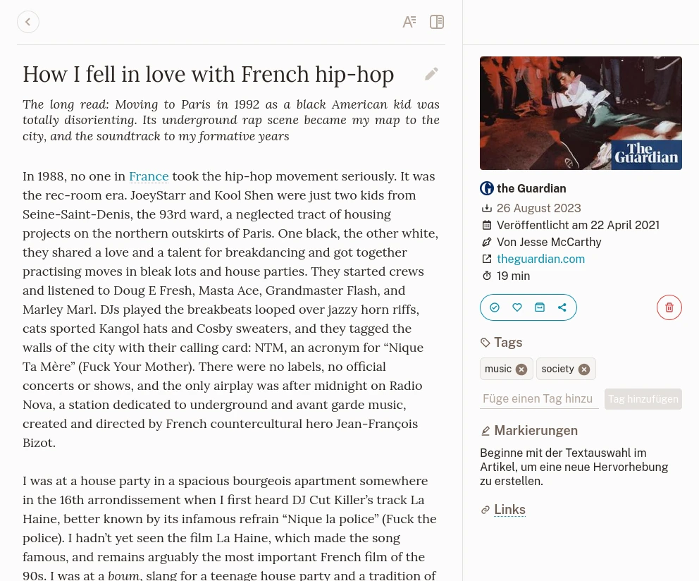
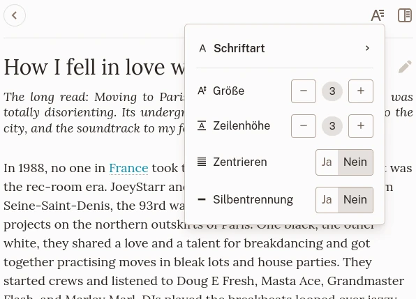
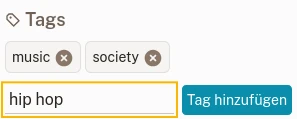
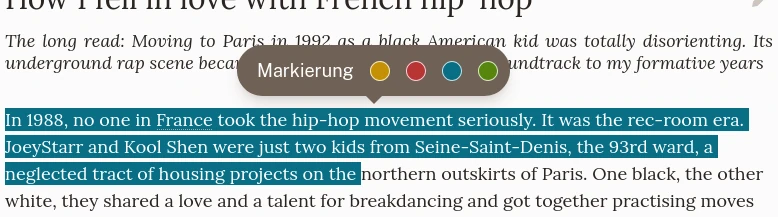

# Lesezeichenansicht

## Die Ansicht

Die Lesezeichenansicht eines Artikels.

Die Lesezeichenansicht ist in 3 Abschnitte unterteilt:

- Oben die Navigations- und Präsentationseinstellungen,
- Der Inhalt,
- Eine Seitenleiste mit Informationen, Beschriftungen, Markierungen und Aktionen.

Ein Lesezeichen rendert seinen Inhalt basierend auf seinem Typ. Es gibt 3 Typen:

### Artikel

Ein Artikel ist eine Seite, aus der der Textinhalt extrahiert wurde. Es wird als lesbare Version seines Inhalts gerendert.

### Bilder

Ein Bild ist eine Seite, die als Bildcontainer erkannt wurde (also ein Link zu Unsplash). Es rendert das gespeicherte Bild.

### Video

Ein Video ist eine Seite, die als Videocontainer identifiziert wurde (d. h. ein Link zu YouTube oder Vimeo). Es rendert einen Videoplayer. Bitte beachten Sie, dass Videos von ihren jeweiligen Remote-Servern abgespielt werden.

## Navigations- und Präsentationseinstellungen

Oben in der Lesezeichenansicht führt Sie ein Link zurück zur vorherigen Seite.

Wenn das Lesezeichen einen Artikel enthält, können Sie über eine Schaltfläche auf der anderen Seite einige Typografieeinstellungen ändern.

Typografieeinstellungen.

Dort können Sie die für den Text verwendete Schriftart, die Schriftgröße und die Zeilenhöhe einstellen.\
Diese Einstellungen werden automatisch für Sie gespeichert und gelten für jeden Artikel, den Sie später lesen.

## Den Titel verändern

Der Titel des Lesezeichens wird automatisch übernommen, wenn Sie ein Lesezeichen erstellen. Sie können diesen abändern wenn Sie darauf klicken und dann auf die Schaltfläche auf der Titelseite klicken.

## Aktionen

In der Lesezeichen-Seitenleiste können Sie Aktionen ausführen.

### Favorit

Dadurch wird der Favoritenstatus des Lesezeichens umgeschaltet.

### Archiv

Dadurch wird das Lesezeichen in die Archive verschoben (oder von dort entfernt).

### Teilen

Der Teilen-Button öffnet ein Menü, über das Sie einen Link erstellen können, wenn Sie einen Artikel mit jemandem teilen möchten.

Im selben Menü können Sie Ihr Lesezeichen exportieren (derzeit nur EPUB), um es auf einem anderen Gerät zu lesen.

### Löschen

Dadurch wird das Lesezeichen zum Löschen markiert.\
Machen Sie sich keine Sorgen, wenn Sie versehentlich darauf klicken! Diese Aktion kann vor dem tatsächlichen Löschen abgebrochen werden.

## Tags

Sie können einem Lesezeichen beliebig viele Tags hinzufügen. Geben Sie dazu einen Text in das Beschriftungsfeld ein und klicken Sie auf **Tag hinzufügen**. Es gibt keine Begrenzung, was ein Etikett sein kann. Sie können sogar Emojis hinzufügen, wenn Sie diese mögen.

Fügen Sie ein neue Tag hinzu.

Weitere Informationen finden Sie im Abschnitt [Tags](./labels.md).

## Markierungen

Haben Sie einen interessanten Teil in einem Artikel gefunden? Sie können es markieren!\
Wenn Sie einen beliebigen Text im Artikel auswählen, wird ein Menü angezeigt, mit dem Sie eine neue Markierung erstellen können.

Erstellen Sie eine neue Markierung.

Ihre Markierungen werden in der Seitenleiste angezeigt.

Wenn Sie eine Markierung entfernen müssen, können Sie dies über die Seitenleiste oder durch Auswahl im Artikel tun.
