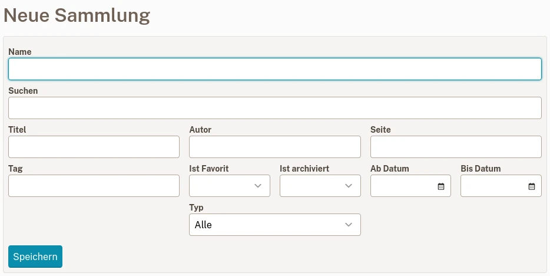

# Sammlungen

Mit Sammlungen können Sie Ihre Lesezeichen einfach organisieren und exportieren
indem Sie die Suchanfragen Ihrer Wahl speichern. 
Wenn Sie ein neues Lesezeichen erstellen, das den Kriterien einer Sammlung entspricht,
es wird sofort angezeigt.
Hier einige Beispiele:

- Die ungelesenen Artikel (keine Bilder oder Videos),
- Die archivierten Artikel von „wikipedia.org“,
- Die Bilder mit der Tag „Katze“,
- Die Artikel, deren Titel „Klima“ enthält.

## Erstellen Sie eine neue Sammlung

Um eine neue Sammlung zu erstellen, gehen Sie zur [Sammlungsliste] (readeck-instance://bookmarks/collections) und klicken Sie auf **Neue Sammlung erstellen**.

Das Sammelformular

Geben Sie beliebige Kriterien ein und klicken Sie auf **Speichern**.

Weitere Informationen zum Filtern finden Sie unter [Lesezeichenfilter](./bookmark-list.md#filters).

## Eine Sammlung exportieren

Auf einer Sammlungsseite können Sie die gesamte Sammlung in eine Datei exportieren.

Derzeit ist nur EPUB verfügbar und exportiert die gesamte Sammlung als einzelnes Buch.

## Eine Sammlung löschen

Öffnen Sie auf einer Sammlungsseite das Feld **Bearbeiten** und klicken Sie auf **Löschen**.

Dieser Vorgang kann für einige Sekunden abgebrochen werden, falls Ihnen ein Fehler unterlaufen ist.
