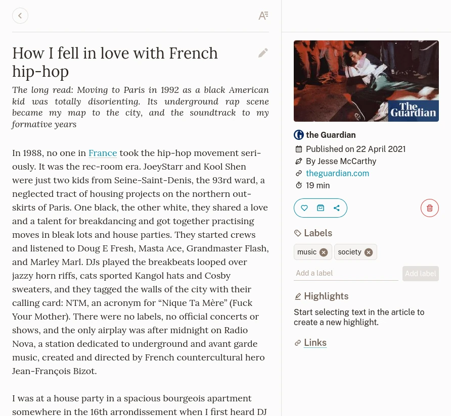
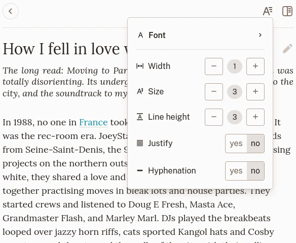
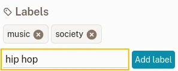
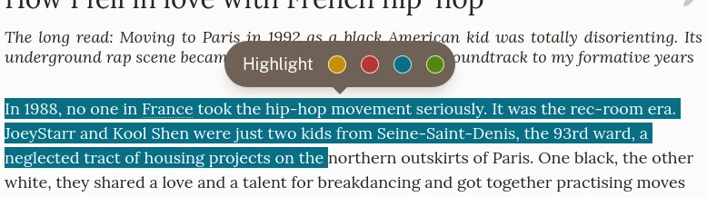

# Bookmark View

## The view

The bookmark view of an article.

The bookmark view is divided in 3 sections:

- On top, the navigation and presentation settings,
- The content,
- A sidebar with information, labels, highlights and actions.

A bookmark renders its content based on its type. There are 3 types:

### Article

An article is a page from which the text content was extracted. It renders as a readable version of its content.

### Picture

A picture is a page that was recognized as a picture container (ie. a link to Unsplash). It renders the stored picture.

### Video

A video is a page that was identified as a video container (ie. a link to Youtube or Vimeo). It renders a video player. Please note that videos are played from their respective remote servers.

## Navigation and presentation settings

On top of the bookmark view, a link takes you back to the previous page.

If the bookmark contains an article, a button on the other side lets you change some typography settings.

Typography settings.

There you can set the font used for the text, the font size and the line height.\
This settings are automatically saved for you and will apply to any article you read later.

## Change the title

The bookmark's title is automatically grabbed when you create it. If, for some reason, you need something else, you can change it by clicking on it and then click the button on the title side.

## Actions

On the bookmark sidebar, you can perform actions.

### Favorite

This toggles the favorite status of the bookmark.

### Archive

This moves the bookmark to the archives (or removes it from there).

### Share

The share button opens a menu from which you can create a link if you want to share an article with someone.

On the same menu, you can export your bookmark (only EPUB for now) to read it on a different device.

### Delete

This marks the bookmark for deletion.\
No worries if you click on this by mistake! This action can be canceled before actual deletion.

## Labels

You can add as many labels as you want to a bookmark. To do so, enter some text in the label field and click on **Add label**. There is no limit as to what can be a label. You can even add emojis if you like them.

Add a new label.

Please read the [Labels](./labels.md) section for more information.

## Highlights

Found some interesting part in an article? You can highlight it!\
When you select any text in the article, a menu appears that lets you create a new highlight.

Create a new highlight.

Your highlights appear in the sidebar.

When you need to remove an highlight, you can do it from the sidebar or by selecting it in the article.
