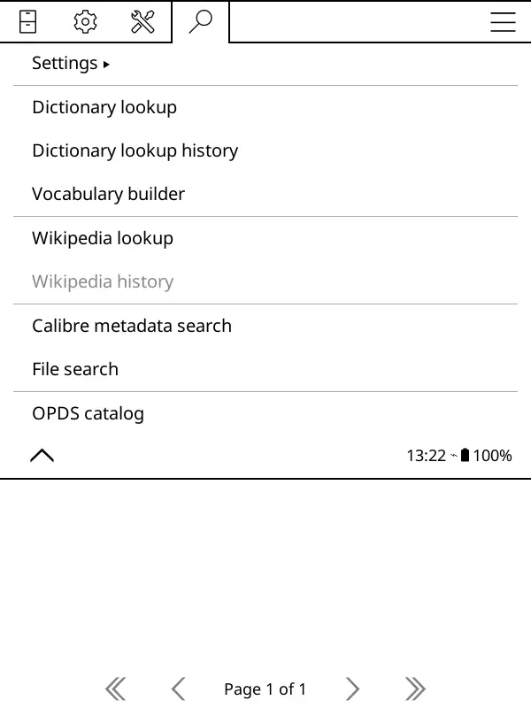
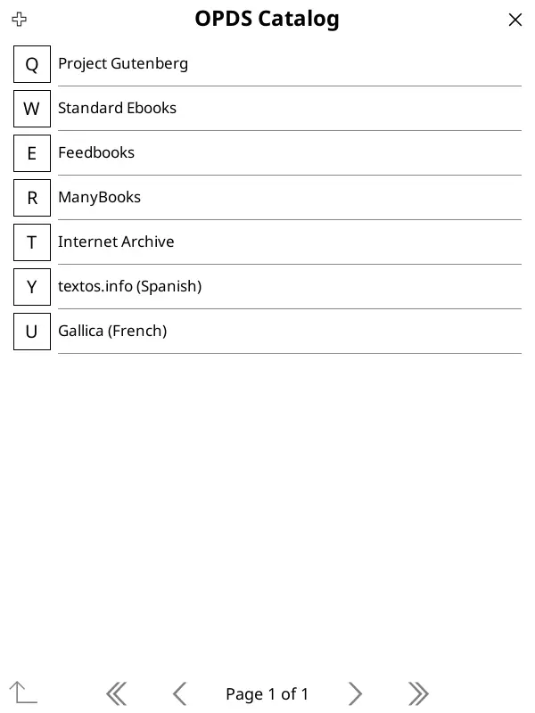
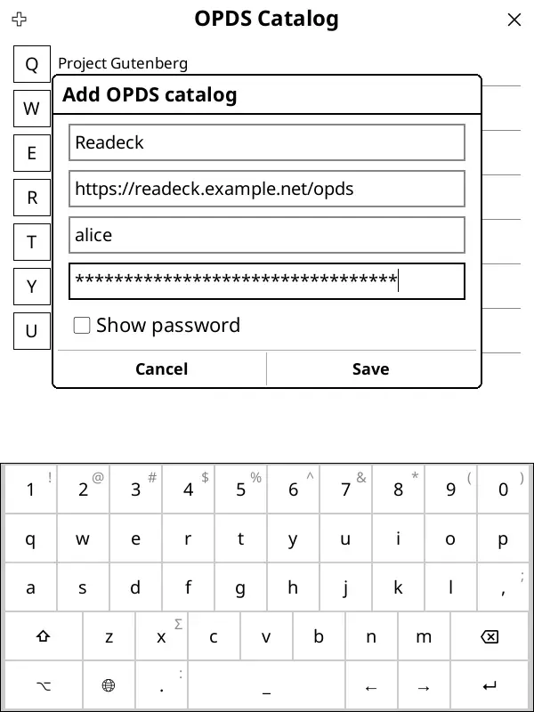

# Ebook Catalog

Readeck provides an Ebook Catalog of all your bookmarks, organized in a catalog with the structure bellow:

- Unread Bookmarks
- Archived Bookmarks
- Favorite Bookmarks
- All Bookmarks
- Bookmark Collections
  - (Collection Name)
    - Collection Ebook
    - Browse Collection

Each section, except Collections, provides every bookmark as an Ebook.

On a collection's section, you can download the full collection as a single Ebook.

## Catalog access

The catalog can be accessed by any app or ereader supporting the OPDS format.
To give access to the catalog, you must first create an [Application Password](readeck-instance://profile/credentials).

You can restrict the permission of this password to "Bookmarks : Read Only".
Write your password down and setup your app.

The URL of your OPDS catalog is: \
[readeck-instance://opds](readeck-instance://opds)

## Example setup: Koreader

[Koreader](https://koreader.rocks/) is a document viewer for E Ink devices. It's available for Kindle, Kobo, PocketBook, Android and desktop Linux. It has a very good OPDS support.

Once you have an Application Password, you can access the OPDS section in Koreader's lookup menu:

This section shows a list of preconfigured OPDS sources and you can add yours by pressing the "+" icon on the top left corner:

In this dialog replace the fields bellow with:

- https://readeck.example.com : `readeck-instance://opds`
- alice: your username
- your application password in the last field

You can now access your bookmarks from Koreader!

