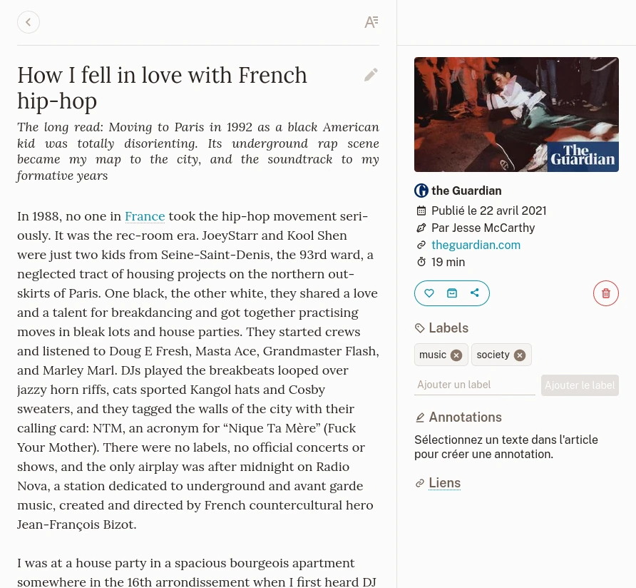
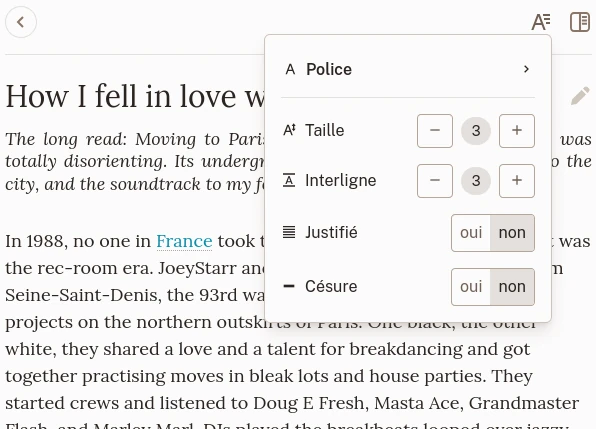
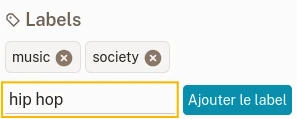
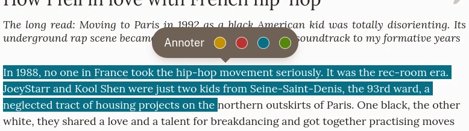

# Détails d'un bookmark

## Vue principale

La vue principale d'un article.

La vue principale d'un bookmark se divise en 3 sections :

- Au dessus, la navigation et les paramètres de présentation,
- Le contenu,
- Une barre latérale avec des informations, les labels, annotations et actions.

Un bookmark affiche son contenu selon son type. Il existe 3 types :

### Article

Un article est une page depuis laquelle on peut extraire un contenu text. L'article est affiché comme la version lisible de son contenu.

### Photo

Une photo est une page qui a été reconnue comme un conteneur pour une image (ex. un lien vers Unsplash). Le bookmark affiche l'image enregistrée.

### Vidéo

Une vidéo est une page qui a été reconnue comme un conteneur pour une vidéo (ex. un lien vers Youtube ou Vimeo). Le bookmark affiche un lecteur de vidéo. Veuillez noter que les vidéos sont jouées depuis le serveur d'origine.

## Navigation et paramètres de présentation

Au dessus de la vue principale, un lien vous permet de retourner à la page précédente.

Si le bookmark contient un article, un bouton sur le côté gauche vous permet de modifier les paramètres de présentation.

Paramètres de présentation.

Vous pouvez y changer la police de caractères, sa taille ou l'interligne.\
Ces paramètres sont sauvegardés automatiquement et seront appliqués à n'importe quel article consulté plus tard.

## Modifier le titre

Le titre d'un bookmark est automatiquement récupéré lors de sa création. Si, pour diverses raisons, vous souhaitez le corriger, vous pouvez le modifier en cliquant dessus puis en validant vos changements avec le bouton à côté du titre.

## Actions

La barre latérale d'un bookmark propose diverses actions.

### Favori

Ceci change l'état favori du bookmark.

### Archive

Ceci déplace le bookmark dans les archive (ou l'en retire s'il y est déjà).

### Partage

Le bouton de partage ouvre un menu depuis lequel vous pouvez créer un lien que vous pouvez partager avec un ami.

Dans le même menu, vous pouvez exporter votre bookmark (seulement EPUB pour le moment) pour le lire sur un autre périphérique.

### Supprimer

Ceci marque le bookmark pour suppression.\
Aucune inquiétude si vous cliquez par erreur ! Cette action peut être annulée avant que la suppression soit effective.

## Labels

Vous pouvez ajouter autant de labels que vous voulez à un bookmark. Pour cela, indiquez le texte du label dans le champ correspondant et cliquez sur **Ajouter un label**. Il n'y a aucune limite quant aux caractères permis dans un label. Vous pouvez même utiliser des emojis si vous le souhaitez.

Ajouter un label.

Veuillez consulter la section [Labels](./labels.md) pour plus d'informations.

## Annotations {#highlights}

Vous avez trouvé une partie intéressante dans un article et souhaitez la marquer comme telle ; vous pouvez l'annoter.\
Quand vous sélectionnez du texte dans un article, un menu apparaît et vous permet de créer une annotation.

Créer une annotation.

Vos annotations apparaissent dans la barre latérale.

Quand vous voulez supprimer une annotation, vous pouvez le faire depuis la barre latérale ou en la sélectionnant dans l'article.
