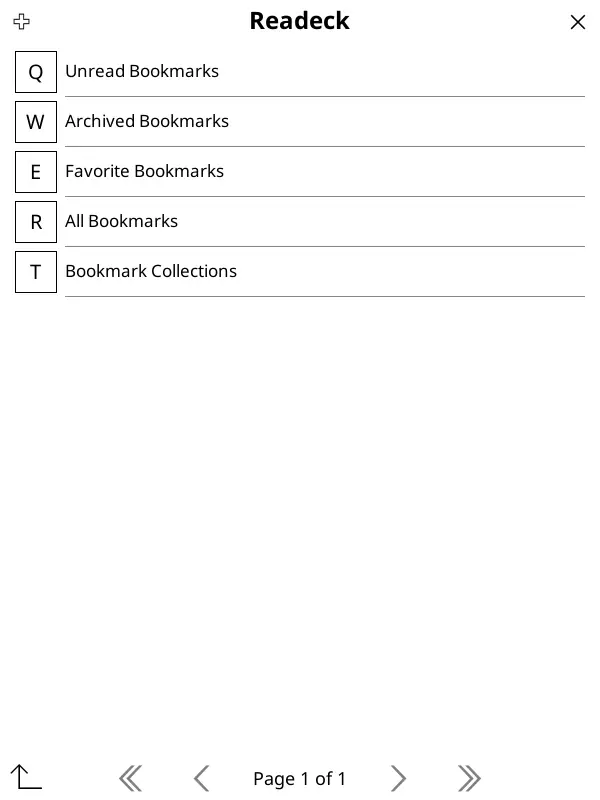

# Catalogue e-book

Readeck fournit un catalogue d'e-book de tous vos bookmarks, organisés selon la structure suivante :

- Bookmarks non lus
- Bookmarks archivés
- Bookmarks favoris
- Tous les bookmarks
- Collections de bookmarks
  - (Nom de la collection)
    - e-book de la collection
    - naviguer dans la collection

Chaque section, à l'exception des Collections, fournit les bookmarks en tant qu'e-book.

Dans la section d'une collection, vous pouvez télécharger l'intégralité de celle-ci sous forme d'un seul e-book.

## Accès au catalogue

Le catalogue est disponible par toute application ou liseuse qui supporte le format OPDS. Pour accéder au catalogue, vous devez au préalable créer un [mot de passe d'application](readeck-instance://profile/credentials).

Vous pouvez restreindre les permissions de ce mot de passe à "Bookmarks: lecture seule". Notez le mot de passe généré et passez au paramétrage de l'application.

L'URL du catalogue OPDS est : \
[readeck-instance://opds](readeck-instance://opds)

## Example de paramétrage : Koreader

[Koreader](https://koreader.rocks/) est un lecteur de documents pour liseuses électroniques. Il est disponible pour Kindle, Kobo, PocketBook, Android et Linux. Il dispose d'un excellent support OPDS.

Une fois que vous avez votre mot de passe d'application, vous pouvez accéder à la section OPDS dans le menu de recherche de Koreader :

Cette section affiche une liste de sources OPDS préconfigurées et vous pouvez ajouter la votre en cliquant sur le bouton "+" dans le coin supérieur gauche :

Dans ce formulaire, remplacez les champs suivants par :

- https://readeck.example.com : `readeck-instance://opds`
- alice: votre nom d'utilisateur
- votre mot de passe d'application dans le dernier champ

Vous pouvez maintenant accéder à vos bookmarks depuis Koreader !

