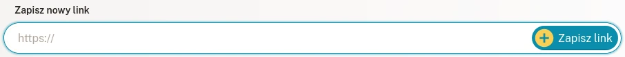
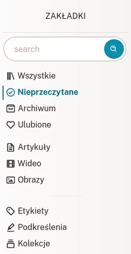
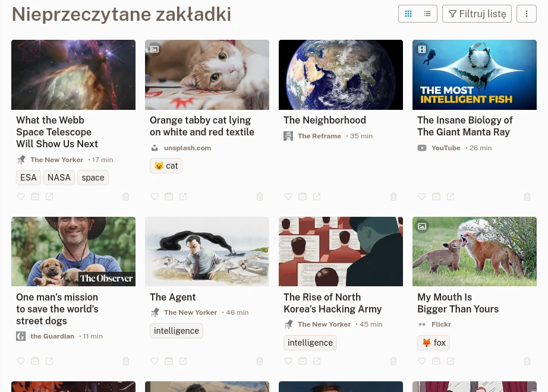
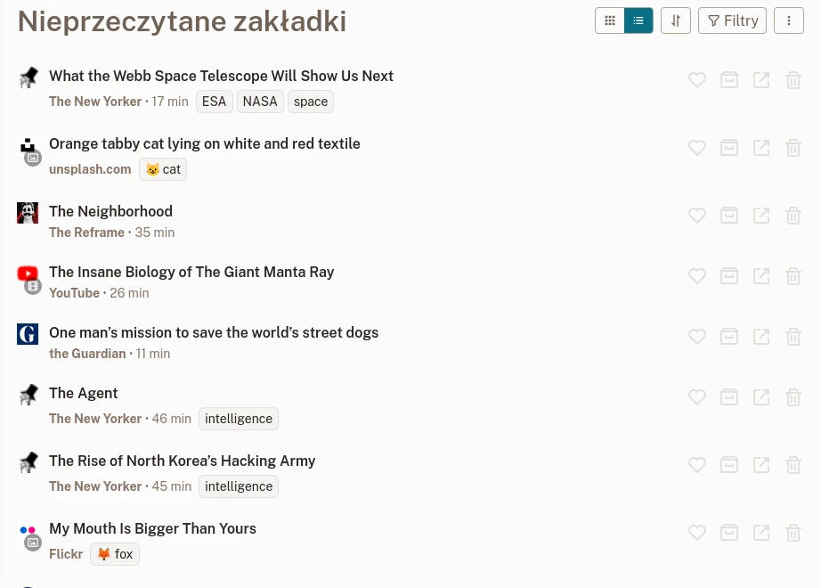
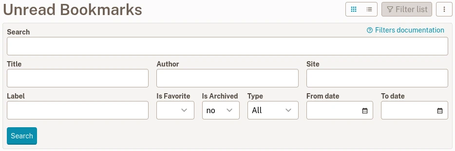
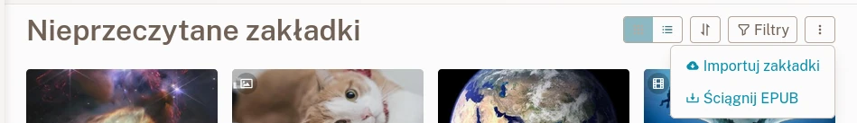

# Zakładki

Zakładki to twoje zapisane ulubione materiały z sieci.

## Stwórz nową zakładkę

Znalezłaś(-eś) stronę, którą ci się podoba? Świetnie! Skopiuj link do niej do pola nazwanego **nowa zakładka** na [Liście Zakładek](readeck-instance://bookmarks).

Twoja zakładka będzie gotowa po kilku sekundach. Możesz ją wtedy otworzyć i przeczytać lub obejrzeć jej zawartość, dodać etykiety, podkreślić tekst albo wyeksportować ją jako ebook. Aby dowiedzieć się więcej, przeczytaj sekcję [Widok Zakładek](./bookmark.md).

## Typy zakładek

Readeck rozróżnia 3 typy materiałów z sieci:

### Artykuł

Artykuł to strona, z której został wyekstraktowany tekst. Wyświetla się on jako zawartość przygotowana do czytania.

### Obraz

Obraz to strona, która została rozpoznana jako kontener obrazów (np. link do strony Unsplash). Wyświetla się jako zapisany obraz.

### Wideo

Wideo to strona, która została zidentyfikowana jako kontener wideo (np. link do Youtube'a lub Viemo). Wyświetla się jako odtwarzacz wideo. Materiały wideo odtwarzane są bezpośrednio ze swoich odpowiadających serwerów.

## Lista Zakładek

Na [liście zakładek](readeck-instance://bookmarks) znajdziesz wszystkie swoje zapisane zakładki.

### Nawigacja

W panelu bocznym znajdziesz pole wyszukiwania i linki, które przeniosą cię do pofiltrowanych list zakładek.

- **Szukaj** \
  Wprowadź hasło do wyszukania (tytuł, zawartość, strona...).
- **Wszystkie** \
  Wszystkie twoje zakładki.
- **Nieprzeczytane** \
  Zakładki, które nie są w archiwum.
- **Archiwum** \
  Zakładki oznaczone jako zarchiwizowane.
- **Ulubione** \
  Zakładki oznaczone jako ulubione.

Jak już zaczniesz zapisywać strony, zobaczysz dodatkowe linki:

- **Artykuły** \
  Twoje zapisane artykuły
- **Wideo** \
  Twoje zapisane wideo
- **Obrazy** \
  Twoje zapisane obrazy

Na końcu zobaczysz 3 sekcje, które przeniosą cię do stron powiązanych z zakładkami:

- **[Etykiety](./labels.md)** \
  Wszystkie twoje etykiety zakładek
- **Podkreślenia** \
  Wszystkie podkreślenia w twoich zakładkach
- **[Kolekcje](./collections.md)** \
  Lista twoich kolekcji

### Karty zakładek

Każdy element na liście nazywany jest Kartą Zakładki.

Lista zakładek w układzie siatki

Każda karta pokazuje:

- **tytuł**, na którym można kliknąć aby obejrzeć lub przeczytać zakładkę,
- **nazwę strony**,
- szacowany **czas czytania**,
- **listę etykiet**,
- **przyciski akcji**

Przyciski akcji służą do:

- **Ulubione** \
  Przełącza stan zakładki jako ulubionej.
- **Archiwum** \
  Przenosi zakładkę do archiwum (lub usuwa ją stamtąd).
- **Usuń** \
  Oznacza zakładkę do usunięcia (można to cofnąć w ciągu kilku sekund).

### Zwarta lista

Jeśli uważasz, że widok zakładek w układzie siatki jest przeładowany, możesz przełączyć się na bardziej zwartą listę z mniejszą liczbą obrazów. Kliknij przycisk obok tytułu, aby przełączyć się z widoku siatki na widok kompaktowy.

Zwarta lista zakładek

## Filtrowanie zakładek {#filters}

Na liście zakładek mozesz filtrować wyniki na podstawie jednego lub kilku kryteriów. Kliknij przycisk "Filtruj listę" obok tytułu strony, aby otworzyć formularz filtrowania.

Formularz filtrowania

Wprowadź kryteria filtrowania i kliknij **Szukaj**.

### Dostępne filtry

Możesz łączyć następujące filtry:

- **Szukaj**\
  Wyszukaj w treści zakładki, jej tytule lub autorach, nazwie i domenie strony oraz etykietach.
- **Tytuł**\
  Wyszukaj tylko w tytule.
- **Autor**\
  Wyszukaj tylko na liście autorów.
- **Strona**\
  Wyszukaj w nazwie i domenie strony.
- **Etykieta**\
  Wyszukaj konkretną etykietę.
- **Czy jest ulubiona**, **Czy jest zarchiwizowana**, **Typ**\
  Te filtry pozwalają ograniczyć wyszukiwanie zgodnie z ich nazwami.
- **Od daty**, **Do daty**\
  Te filtry na końcu pozwalają ograniczyć zakres czasu od kiedy i do kiedy zakładka została zapisana. Na przykład, możesz wyszukać listę zakładek zapisanych w ciągu ostatnich 4 tygodni, ale nie w ostatnim tygodniu.

### Zapytanie wyszukiwania

Pola **Szukaj**, **Tytuł**, **Autor**, **Strona** i **Etykieta** używają kryteriów wyszukiwania w taki sam sposób:

- `zaskoczony kot` wyszuka zawartość ze słowami **zaskoczony** i **kot**
- `"zaskoczony kot"` wyszuka zawartość z dokładnie taki słowami: **zaskoczony kot**.
- `kot*` wyszuka zawartość ze słowami zaczynającymi się na **kot** (kot, kotka i kotlety będą wszystkie pasować).
- `-zaskoczony kot` wyszuka zawartość ze słowem **kot** ale BEZ słowa **zaskoczony**.

Po wyszukaniu danej frazy możesz dane wyszukiwanie zapisać na stałe jako [kolekcję](./collections.md).

## Eksport i import zakładek

Menu listy zakładek

### Eksport zakładek

Przycisk menu obok przycisku filtrowania pozwala ściągnąć plik EPUB z zawartością obecnie wyświetlanej listy zakładek. Eksportuje on jednego e-booka zawierającego wszystkie artykuły zorganizowane w rozdziały.

### Import zakładek

W tym samym menu znajdziesz link [Importuj zakładki](readeck-instance://bookmarks/import). Przeniesie cię on do kreatora importu, który pozwoli ci zaimportować twoje istniejące zakładki z wielu różnych źródeł.
