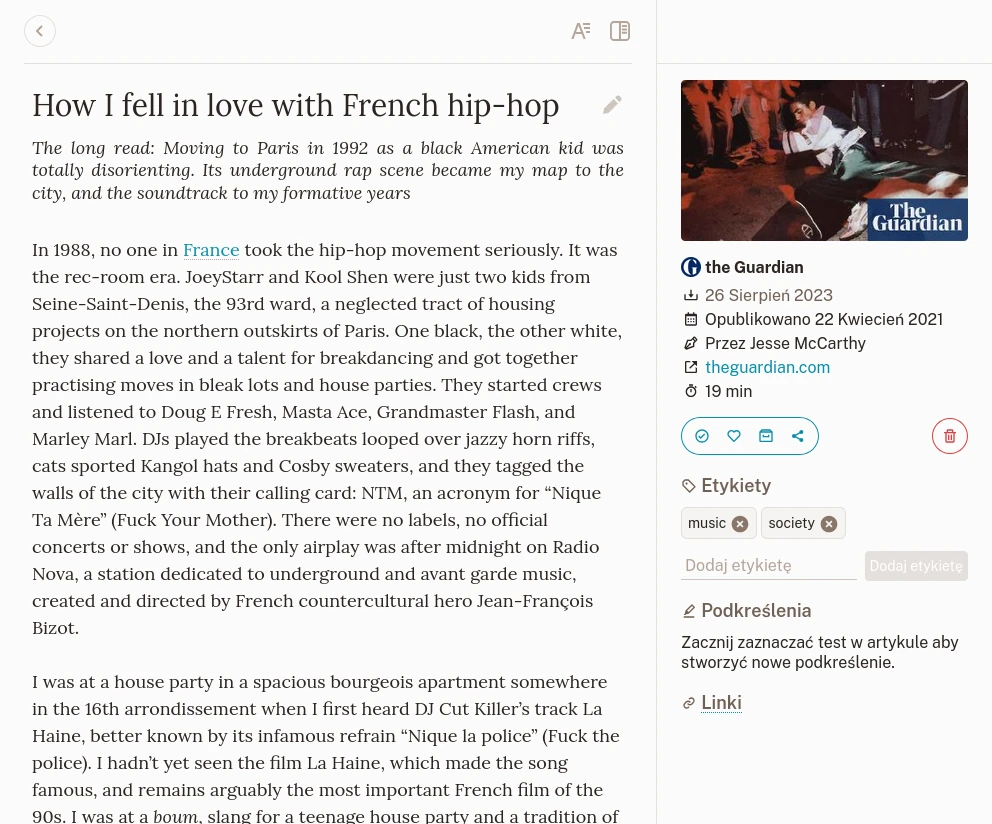
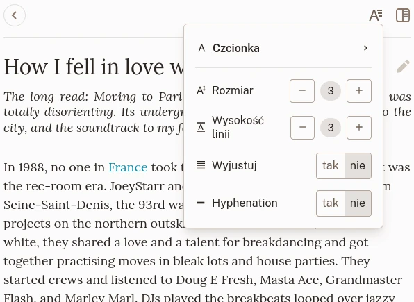
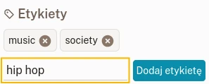
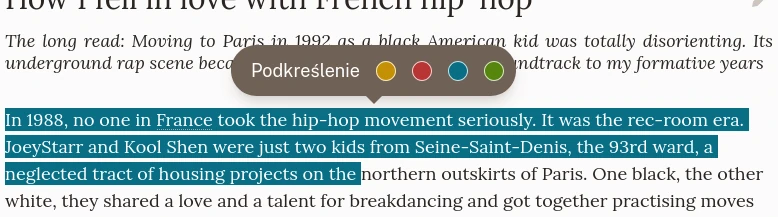

# Widok Zakładki

## Widok

Widok zakładki artykułu.

Widok zakładki jest podzielony na 3 sekcje:

- Na górze ustawienia nawigacji i wyświetlania,
- Zawartość,
- Pasek boczny z informacjami, etykietami, podkreśleniami i akcjami.

Zakładka jest wyświetlana zależnie od swojego typu. Istnieją 3 typy:

### Artykuł

Artykuł to strona, z której wyekstraktowana została treść tekstowa. Wyświetla się jako zawartość przygotowana do czytania.

### Obraz

Obraz to strona rozpoznana jako kontener obrazów (np. link do strony Unsplash). Wyświetla się jako zapisany obraz.

### Wideo

Wideo to strona rozpoznana jako kontener wideo (np. link do Youtube'a lub Vimeo). Wyświetla się jako odtwarzacz wideo. Materiały wideo odtwarzane są bezpośrednio ze swoich odpowiadających serwerów.

## Ustawienia nawigacji i wyświetlania

Na górze widoku zakładki znajduje się link, który przenosi do poprzedniej strony.

Jeśli zakładka zawiera artykuł, przycisk po prawej stronie pozwala zmienić ustawienia typografii.

Ustawienia typografii.

Tutaj możesz ustawić czcionkę używaną do wyświetlania tekstu, rozmiar czcionki i wysokość linii.\
Te ustawienia są automatycznie zapisywane i będą miały zastosowanie do każdego artykułu, który będziesz później czytał.

## Zmień tytuł

Tytuł zakładki jest pobierany automatycznie w momencie jej tworzenia. Jeśli z jakiegoś powodu potrzebujesz innego tytułu, możesz go zmienić klikając najpierw na nim, a później na przycisk z boku tytułu.

## Akcje

Z paska bocznego zakładki możesz wykonywać akcje.

### Ulubione

Przełącza stan zakładki jako ulubionej.

### Archiwum

Przenosi zakładkę do archiwum (lub usuwa ją stamtąd).

### Udostępnij

Przycisk udostępniania otwiera menu, w którym możesz stworzyć link, jeśli chcesz udostępnić komuś dany artykuł.

W tym samym menu możesz wyeksportować zakładkę (na razie tylko plik EPUB) aby przeczytać ją na innym urządzeniu.

### Usuń

Oznacza zakładkę do usunięcia.\
Nie martw się jeśli kliknąłeś tutaj przez przypadek! Ta akcja może zostać anulowana przed właściwym usunięciem.

## Etykiety

Do zakładki możesz dodać tyle etykiet, ile tylko chcesz. Aby to zrobić, wprowadź jakiś tekst w polu etykiety i kliknij na **Dodaj etykietę**. Nie ma ograniczeń na to co może być etykietą. Możesz nawet dodać emotki jeśli chcesz.

Dodaj nową zakładkę.

Poczytaj sekcję [Etykiety](./labels.md) jeśli potrzebujesz więcej informacji.

## Podświetlenia

Znalazłaś(-eś) jakis interesujący fragment artykułu? Możesz go podkreślić!\
Gdy zaznaczysz jakikolwiek tekst w artykule, pojawi się menu, które pozwoli ci stworzyć nowe podkreślenie.

Stwórz nowe podkreślenie.

Twoje podkreślenia pojawią się na pasku bocznym.

Gdy potrzebujesz usunąć podkreślenie, możesz to zrobić z paska bocznego lub po zaznaczeniu podświetlenia w artykule.
