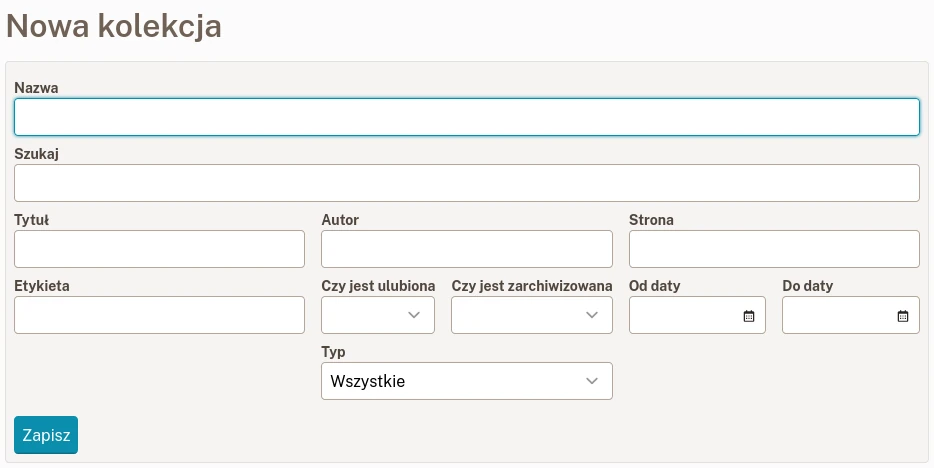

# Kolekcje

Kolekcje umożliwiają łatwe porządkowanie i eksportowanie zakładek poprzez zapisywanie wybranych żądań wyszukiwania. Po utworzeniu nowej zakładki, która spełnia kryteria kolekcji, zostanie ona natychmiast wyświetlona.
Oto kilka przykładów:

- Nieprzeczytane artykuły (bez zdjęć i filmów),
- Zarchiwizowane artykuły z „wikipedia.org”,
- Zdjęcia z etykietą „kot”,
- Artykuły zawierające „klimat” w tytule.

## Stwórz nową kolekcję

Aby stworzyć nową kolekcję, przejdź do [Listy kolekcji](readeck-instance://bookmarks/collections) i kliknij na **Stwórz nową kolekcję**.

Formularz kolekcji

Wpisz jakiekolwiek kryteria i kliknij na **Zapisz**.

Przeczytaj [filtry zakładek](./bookmark-list.md#filters) aby dowiedzieć się więcej o filtrowaniu.

## Eksportuj kolekcję

Na stronie kolekcji możesz wyeksportować całą kolekcję do pliku.

Na razie, tylko plik EPUB jest dostępny i zawiera on całą kolekcję jako pojedyńczą książkę.

## Usuń kolekcję

Na stronie kolekcji otwórz okno **Edytuj** i kliknij na **Usuń**.

Jeśli popełniłeś błąd, to a operacja może zostać anulowana w ciągu kilku sekund.
