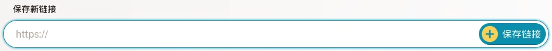
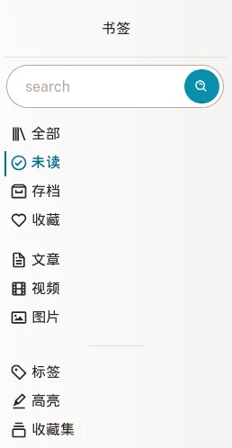
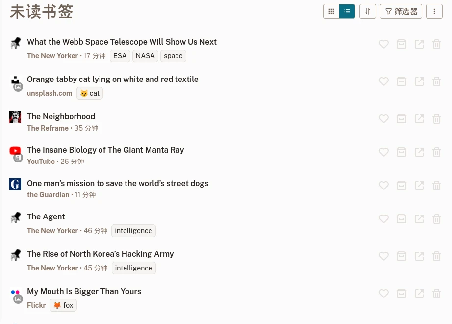
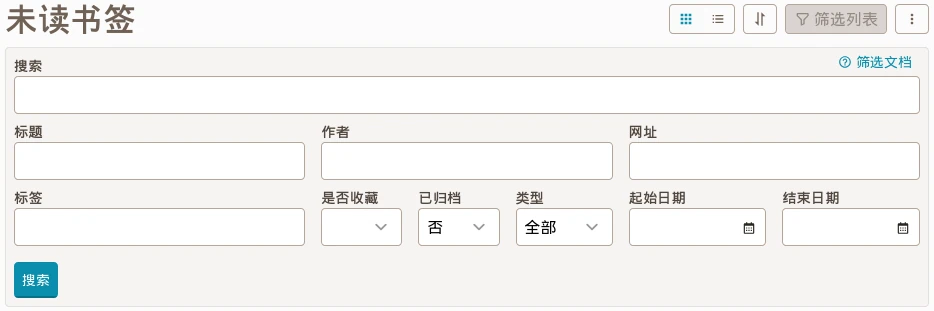
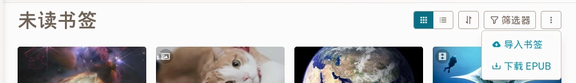

# 书签列表

书签是你在网页上保存的感兴趣的内容。

## 创建新的书签

发现了一个你喜欢的页面? 很棒! 将链接复制到 [书签列表](readeck-instance://bookmarks) 上方的输入框中。

几秒钟后，您的书签将准备就绪。 然后，您可以打开它阅读或观看其内容，添加标签，突出显示文本或导出电子书。 更多信息, 请阅读 [书签视图](./bookmark.md) 部分。

## 书签类型

Readeck 识别3种不同类型的网络内容:

### 文章

文章是从中提取文本内容的页面。它呈现为其内容的可读版本。

### 图片

图片是一个被识别为图片容器的页面（即指向Unsplash的链接）。它渲染存储的图片。

### 视频

视频是一个被标识为视频容器的页面（即指向Youtube或Vimeo的链接）。它渲染视频播放器。请注意，视频是从各自的远程服务器播放的。

## 书签列表

[书签列表](readeck-instance://bookmarks) 您可以在此处找到所有已保存的书签。

### 导航

在侧边栏上，您将找到一个搜索字段和链接，这些链接将带您进入过滤后的书签列表。

- **搜索** \
  输入任何搜索词（标题、内容、网站…）。
- **全部** \
  你的全部书签。
- **未读** \
  没有归档的书签。
- **已归档** \
  已标记归档的书签。
- **我的收藏** \
  已收藏的书签。

一旦开始保存页面，您将看到以下附加链接：

- **文章** \
  你的文章书签。
- **视频** \
  你的视频书签。
- **图片** \
  你的图片书签。

最后，您将看到以下链接：

- **[标签](./labels.md)** \
  所有书签标签。
- **高亮** \
  书签上的所有高亮内容。
- **[集合](./collections.md)** \
  所有集合列表。

### 书签卡片

列表中的每个项目都称为书签卡片。

网格书签列表

卡片展示书签的以下信息:

- **标题**
- **网站名称**
- **阅读耗时**
- **标签列表**
- **操作按钮**

操作按钮:

- **收藏** \
  切换收藏状态。
- **归档** \
  移动书签到归档状态（或删除归档状态）。
- **删除** \
  删除书签（可以在几秒内撤销）。

### 紧凑视图

如果您觉得书签网格视图图像太拥挤，可以切换到图像较少的更紧凑的列表。单击标题旁边的按钮，从网格视图切换到紧凑视图。

紧凑书签列表

## 筛选书签 {#筛选}

在书签列表中，您可以根据一个或多个条件筛选结果。单击页面标题旁边的“筛选列表”按钮打开筛选表单。

筛选表单

输入任何条件并单击 **搜索**.

### 可用过滤器

您可以组合以下筛选器：

- **搜索** \
  在书签的文本、标题、作者、网站名称和域名以及标签中搜索。
- **标题** \
  仅搜索书签标题。
- **作者** \
  仅搜索书签作者。
- **网站** \
  仅搜索书签网站。
- **标签** \
  仅搜索书签标签。
- **是否收藏**, **是否归档**, **类型** \
  筛选书签收藏、归档和类型。
- **起始日期**, **结束日期** \
  最后一个过滤器允许您限制书签的保存时间。例如，这允许您检索过去4周内保存的书签列表，但不包括上周之后的书签列表。

### 搜索查询

**搜索**, **标题**, **作者**, **网站** 和 **标签** 字段以相同的方式理解搜索条件:

- `startled cat` 会查找包括 **startled** 和 **cat** 的内容。
- `"startled cat"` 会查找和 **startled cat** 完全一致的内容。
- `cat*` 会查找以 **cat** 开头的内容 (包括 cat, catnip 和 caterpillar)。
- `-startled cat` 会查找包括 **cat** 但不包括 **startled** 的内容。

执行搜索后, 你可以将其保存到一个新的 [集合](./collections.md) 使其永久保存。

## 导入导出

书签列表菜单

### 导出书签

过滤器按钮旁边的菜单按钮允许您下载当前书签列表的 EPUB 文件。它会导出一本电子书，其中包含按章节组织的所有文章。

### 导入书签

在同一菜单中，您将找到 [导入书签](readeck-instance://bookmarks/import) 链接。 它将带您进入一个导入向导，允许您从各种来源导入现有书签。
