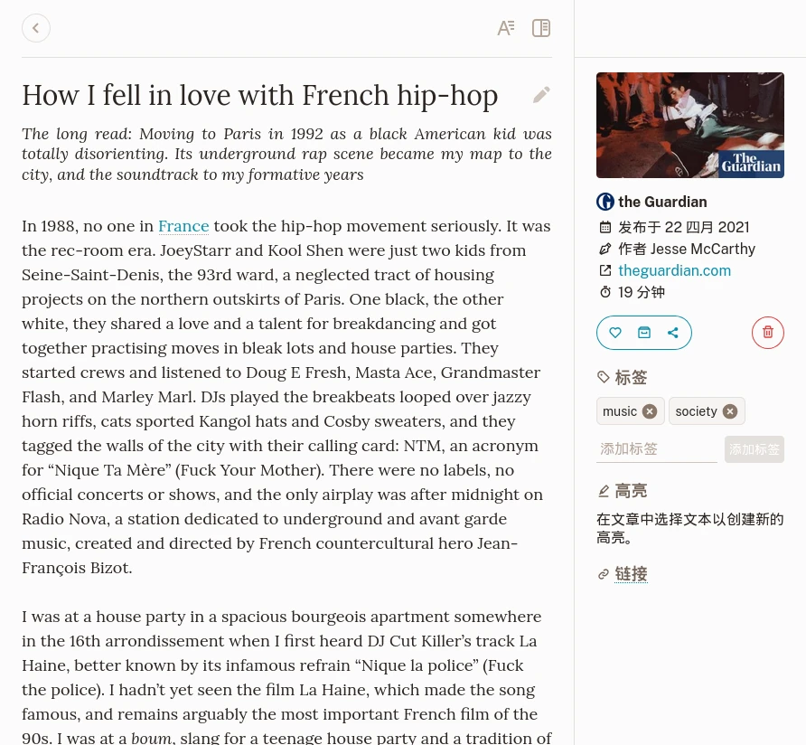
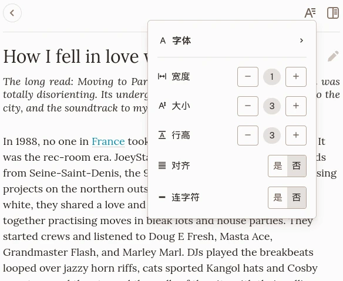
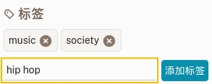
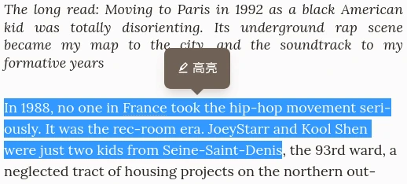

# 书签

## 视图

文章书签视图。

书签视图分为三个部分:

- 最上面是导航和演示设置
- 内容
- 带有信息、标签、突出显示和操作的侧边栏

书签根据其类型呈现其内容。有三种类型：

### 文章

文章是从中提取文本内容的页面。它呈现为其内容的可读版本。

### 图片

图片是一个被识别为图片容器的页面（即指向Unsplash的链接）。它渲染存储的图片。

### 视频

视频是一个被标识为视频容器的页面（即指向Youtube或Vimeo的链接）。它渲染视频播放器。请注意，视频是从各自的远程服务器播放的。

## 导航和排版

在书签视图的顶部，有一个链接可以带您返回上一页。

如果书签包含一篇文章，另一侧的按钮可以让你更改一些排版设置。

书签排版设置

在那里，您可以设置文本使用的字体、字体大小和行高。此设置会自动为您保存，并将应用于您以后阅读的任何文章。

## 修改标题

书签的标题在您创建时会自动抓取。如果出于某种原因，您需要其他内容，您可以通过单击它，然后单击标题侧的按钮来更改它。

## 操作

在书签侧边栏上，您可以执行操作。

### 收藏

切换书签的收藏状态。

### 归档

将书签移至已归档或者移除。

### 分享

共享按钮打开一个菜单，如果你想与某人共享一篇文章，可以从中创建链接。

在同一菜单上，您可以导出书签（目前仅EPUB），以便在其他设备上阅读。

### 删除

这将标记书签以进行删除。
如果你误点击了这个，不用担心！此操作可以在实际删除之前取消。

## 标签

您可以在书签中添加任意数量的标签。为此，请在标签字段中输入一些文本，然后单击 **添加标签**。 标签是没有限制的。如果你喜欢，你甚至可以添加表情符号。

添加标签。

请阅读 [标签](./labels.md) 部分了解更多信息。

## 高亮

在一篇文章中发现了一些有趣的部分？你可以突出它。
当您选择文章中的任何文本时，会出现一个菜单，允许您创建新的突出显示。

创建新的高亮。

您的高亮显示在侧边栏中。
当你需要删除高亮时，你可以从侧边栏中删除，也可以在文章中选择它。
