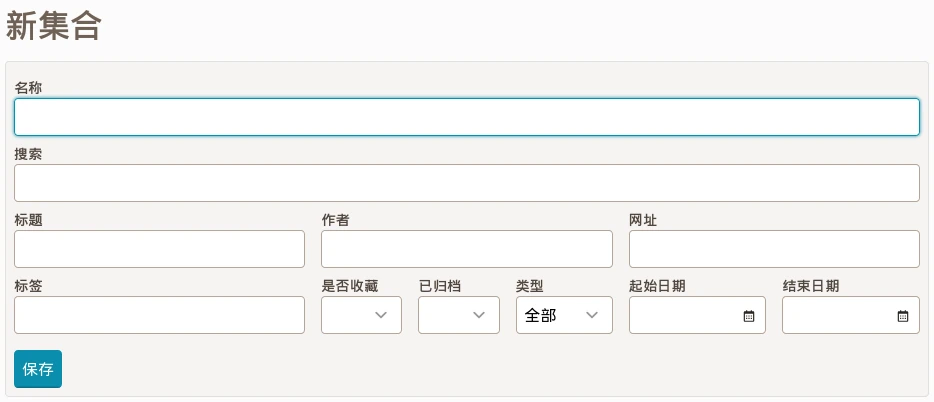

# 集合

集合让您能够通过保存您选择的搜索请求轻松组织和导出书签。
当您创建符合集合标准的新书签时，它将立即出现。

例如:

- 未读文章（无图片或视频）
- 来自“wikipedia.org”的归档文章
- 带有“cat”标签的图片
- 标题中包含“climate”的文章

## 创建集合

要创建集合, 请查看 [集合列表](readeck-instance://bookmarks/collections) 并点击 **创建集合**.

集合表单

输入任何条件并单击 **保存**.

请跳转 [书签筛选](./bookmark-list.md#filters) 查看更多筛选相关的内容。

## 导出集合

在收藏页面上，您可以将完整收藏导出到文件中。

目前，只有 EPUB 可用，并将整个收藏导出为一本书。

## 删除集合

在集合页面, 打开 **编辑** 框然后点击 **删除**.

若是误操作，可以在几秒内取消删除。
