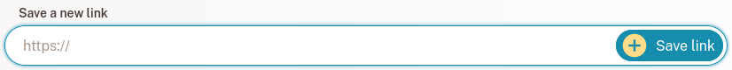
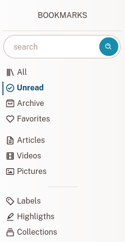
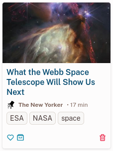

# Bookmarks

Bookmarks are where you save the web content you like.

## Create a new Bookmark

Found a web page you like? Great! Copy its link into the text field named **new bookmark** on the [Bookmark List](../../bookmarks).

After a few seconds, your bookmark will be ready. You can then open it to read or watch its content, add labels, highlight text or export an ebook (for more information, please read the [Bookmark View](./bookmark.md) section).

## Bookmark type

Readeck recognizes 3 different types of web content:

### Article

An article is a page from which the text content was extracted. It renders as a readable version of its content.

### Picture

A picture is a page that was recognized as a picture container (ie. a link to Unsplash). It renders the stored picture.

### Video

A video is a page that was identified as a video container (ie. a link to Youtube or Vimeo). It renders a video player. Please note that videos are played from their respective remote servers.

## Bookmark List

The [bookmark list](../../bookmarks) is where you'll find all your saved bookmarks.

### Navigation

On the sidebar, you'll find a search field and links that will take you to filtered bookmark lists.

Search
: Enter any search term (title, content, website...)

All
: All your bookmarks.

Unread
: The bookmarks that are not in the archive.

Archive
: The bookmarks you marked as archived.

Favourites
: The bookmarks you marked as favourite.

Once you start saving pages, you'll see the following additional links:

Articles
: Your article bookmarks

Videos
: Your video bookmarks

Pictures
: Your picture bookmarks

Finally, you'll see 2 more sections that are covered in other help topics:

- [Collections](./collections.md)
- [Labels](./labels.md)

### Bookmark Cards

Each item on a list is called a Bookmark Card.

A card shows:

- the **title** on which you can click to watch or read the bookmark,
- the **site name**,
- the estimated **reading time**,
- the **tag list**,
- **action buttons**

The action buttons perform the following:

Favourite
: This toggles the favourite status of the bookmark.

Archive
: This moves the bookmark to the archives (or removes it from there).

Delete
: This marks the bookmark for deletion (it can be canceled during a few seconds).
